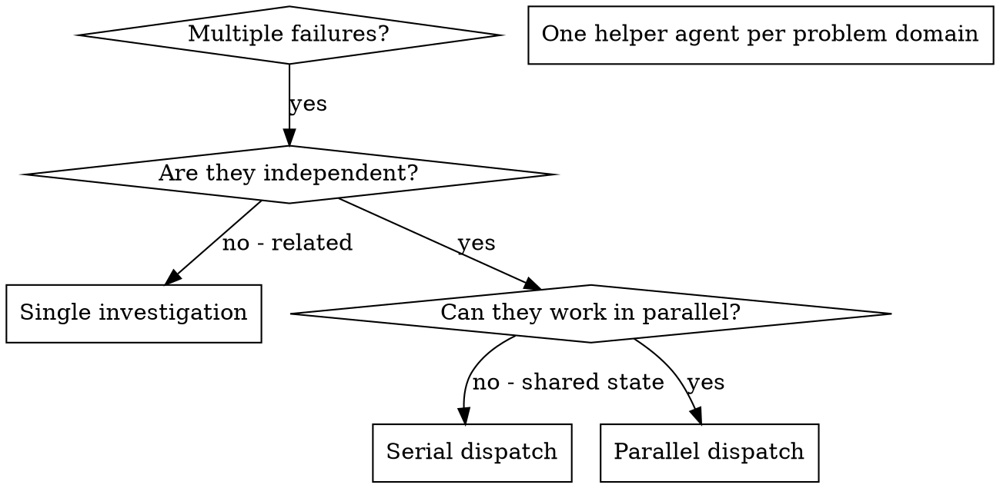

# Dispatching Parallel Agents

## Overview

You delegate tasks to specialized helper agents with isolated context. By precisely crafting their instructions and context, you ensure they stay focused and succeed at their task. They should never inherit your full session context or history - you construct exactly what they need. This also preserves your own context for coordination work.

When you have multiple unrelated failures, investigating them sequentially wastes time. Each investigation is independent and can happen in parallel.

**Core principle:** Dispatch one helper agent per independent problem domain. Let them work concurrently when the current harness supports it.

## When to Use

**Use when:**
- 3+ test files fail with different root causes
- Multiple subsystems are broken independently
- Each problem can be understood without context from others
- No shared state exists between investigations

**Don't use when:**
- Failures are related
- You need to understand the full system state first
- Agents would interfere with each other

## The Pattern

### 1. Identify Independent Domains

Group failures by what's broken. Each domain should be independently understandable and fixable.

### 2. Create Focused Agent Tasks

Each helper agent gets:
- **Specific scope:** one test file or subsystem
- **Clear goal:** make these tests pass / isolate this failure
- **Constraints:** don't change unrelated code
- **Expected output:** summary of what was found and fixed

### 3. Dispatch in Parallel

If the current harness supports parallel helper agents, dispatch one task per domain concurrently. If it does not, use the same decomposition but run the investigations serially.

### 4. Review and Integrate

When agents return:
- Read each summary
- Verify fixes don't conflict
- Run the full test suite
- Integrate all changes

## Agent Prompt Structure

Good agent prompts are:
1. **Focused** - one clear problem domain
2. **Self-contained** - all context needed to understand the problem
3. **Specific about output** - what should the agent return?

## Common Mistakes

**Too broad:** "Fix all the tests" - the agent gets lost

**No context:** "Fix the race condition" - the agent doesn't know where

**No constraints:** the agent may refactor everything

**Vague output:** you don't know what changed

## When NOT to Use

**Related failures:** fixing one might fix others - investigate together first

**Need full context:** understanding requires seeing the entire system

**Exploratory debugging:** you don't know what's broken yet

**Shared state:** agents would interfere (editing the same files, using the same resources)

## Verification

After agents return:
1. **Review each summary** - understand what changed
2. **Check for conflicts** - did agents edit the same code?
3. **Run the full suite** - verify all fixes work together
4. **Spot check** - agents can make systematic errors
