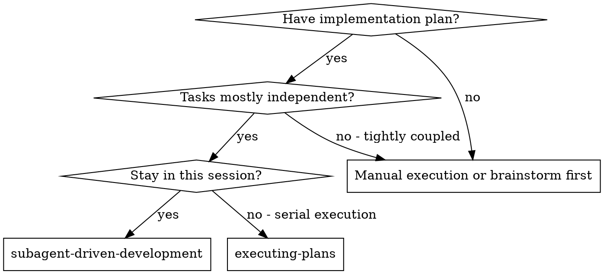
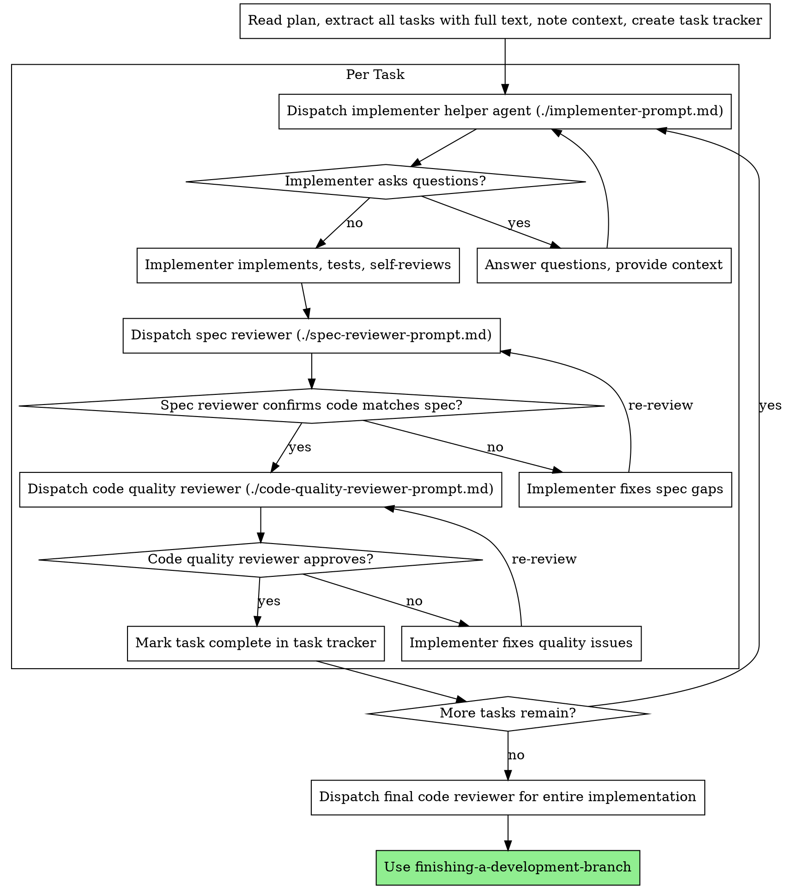

# Subagent-Driven Development

Execute a plan by dispatching a fresh helper agent per task when the current harness supports it, with two-stage review after each task: spec compliance review first, then code quality review.

**Why helper agents:** You delegate tasks to specialized agents with isolated context. By precisely crafting their instructions and context, you ensure they stay focused and succeed at their task. They should never inherit your session's context or history - you construct exactly what they need. This also preserves your own context for coordination work.

**Core principle:** Fresh helper agent per task + two-stage review (spec then quality) = high quality, fast iteration.

## When to Use



**Use this only when helper-agent support is actually available.** If it is not, use `executing-plans` instead of trying to simulate this workflow by hand.

## The Process



## Model Selection

Use the least powerful model that can handle each role to conserve cost and increase speed.

- **Mechanical implementation tasks**: use a fast, cheap model
- **Integration and judgment tasks**: use a standard model
- **Architecture, design, and review tasks**: use the most capable available model

## Handling Implementer Status

Implementer helper agents report one of four statuses. Handle each appropriately:

**DONE:** Proceed to spec compliance review.

**DONE_WITH_CONCERNS:** Read the concerns before proceeding. If they are about correctness or scope, address them before review.

**NEEDS_CONTEXT:** Provide the missing context and re-dispatch.

**BLOCKED:** The implementer cannot complete the task. Assess the blocker:
1. If it's a context problem, provide more context and re-dispatch
2. If the task requires more reasoning, re-dispatch with a more capable model
3. If the task is too large, break it into smaller pieces
4. If the plan itself is wrong, escalate to the user

**Never** ignore an escalation or force the same model to retry without changes.

## Prompt Templates

- `./implementer-prompt.md` - dispatch implementer helper agent
- `./spec-reviewer-prompt.md` - dispatch spec compliance reviewer
- `./code-quality-reviewer-prompt.md` - dispatch code quality reviewer

## Example Workflow

```
You: I'm using Subagent-Driven Development to execute this plan.

[Read plan file once: docs/superpowers/plans/feature-plan.md]
[Extract all tasks with full text and context]
[Create a task tracker with all tasks]

Task 1:
[Dispatch implementation helper agent with full task text + context]
[Handle questions if any]
[Review for spec compliance]
[Review for code quality]
[Mark Task 1 complete]

...

[After all tasks]
[Dispatch final code review]
[Use finishing-a-development-branch]
```

## Advantages

**vs. Manual execution:**
- Helper agents follow TDD naturally
- Fresh context per task
- Review checkpoints are explicit

**vs. Executing Plans:**
- Same session
- Continuous progress
- Review checkpoints after each task

## Red Flags

**Never:**
- Start implementation on `main`/`master` without explicit user consent
- Skip reviews (spec compliance OR code quality)
- Proceed with unfixed issues
- Dispatch multiple implementation helper agents in parallel when they could conflict
- Make a helper agent read the plan file when you could provide the relevant task text directly
- Skip scene-setting context
- Ignore helper-agent questions
- Start code quality review before spec compliance passes
- Move to the next task while either review has open issues

## Integration

**Required workflow skills:**
- **using-git-worktrees** - set up an isolated workspace before starting
- **writing-plans** - creates the plan this skill executes
- **requesting-code-review** - review template for reviewer helper agents
- **finishing-a-development-branch** - completes development after all tasks

**Helper agents should use:**
- **test-driven-development** - follow TDD for each task

**Alternative workflow:**
- **executing-plans** - use for serial execution instead of same-session helper-agent execution
